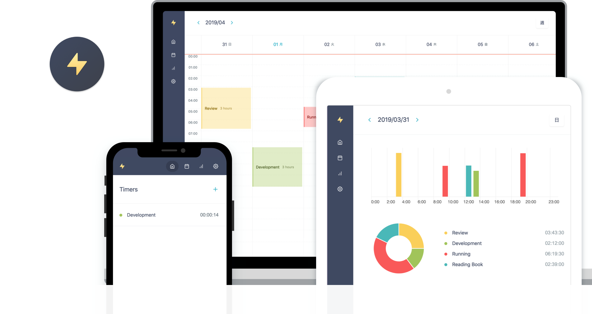
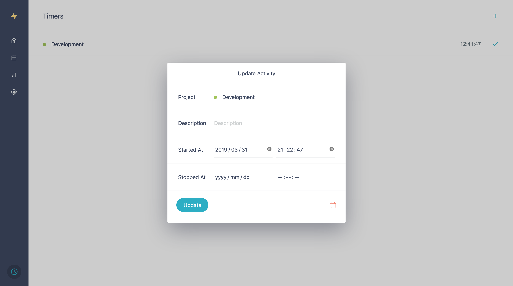
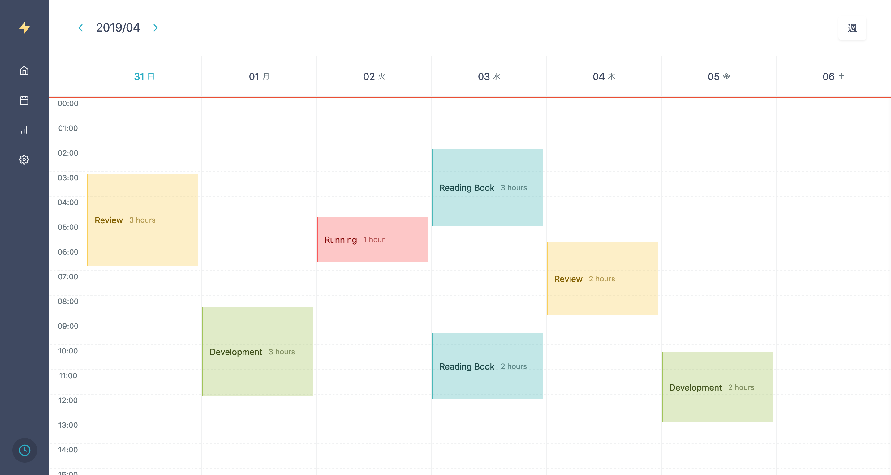
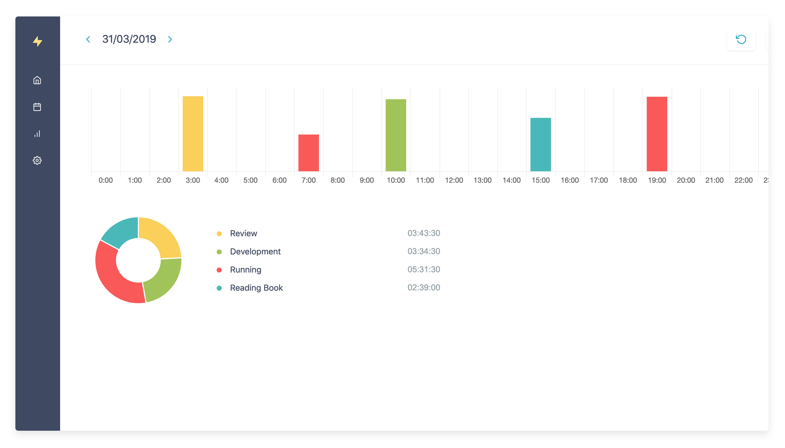
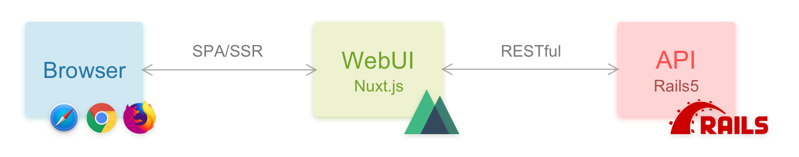

[English](./README.md) | [日本語](./README.ja.md)

---

# Hackaru



## どんなアプリ?
Hackaru (測る) はシンプルなタイムトラッキングアプリです。

## 特徴

- [PWA](https://developers.google.com/web/progressive-web-apps/) をサポート。 App StoreやGoogle Playからダウンロードしなくても、ホーム画面に追加するだけで快適に使用できます。
- OAuth2認証をサポート。サードパーティ製のアプリやプラグインを作成できます。
- Webhookをサポート。 (例: タイマー開始時、タイマー終了時 など)
- オープンソースなので、プライベートのサーバ上に構築することができます。
- [Hackaru for Desktop](https://github.com/ktmouk/hackaru-desktop) と連携すれば、普段使っているアプリの使用時間を自動で計測できます。(Atom Editor、Illustrator など)

## 公式サイト
下記のサイトでサービスを無償提供しています！環境を構築するのが面倒な方は、ぜひお試しください。
- https://www.hackaru.app

> <a href="https://www.buymeacoffee.com/T4KDHBPV6"></a>   
> もし気に入ってくれたら、寄付していただけると嬉しいです。 :relaxed:

## Dockerで使う

1. [Docker](https://docs.docker.com/install/) と [Docker Compose](https://docs.docker.com/compose/install/) をインストール。

2. このリポジトリをcloneします。
```
$ git clone https://github.com/ktmouk/hackaru.git
$ cd /hackaru
```

3. 環境変数のサンプルファイルを複製、ファイル名を変更します。
```
$ cp .env.api.sample .env.api
$ cp .env.web.sample .env.web
```

4. `.env.api` 内の `SECRET_KEY_BASE` と `JWT_SECRET` に、シークレット値を設定します。  
シークレット値の生成には `rake:secret` を使用できます。
```
# シークレット値を生成
$ docker-compose run --rm api rails db:create db:migrate
```
シークレット値を設定します。
```
# Rails
RAILS_ENV=production
RAILS_LOG_TO_STDOUT=true
SECRET_KEY_BASE=    # 生成したシークレット値を設定
JWT_SECRET=         # 生成したシークレット値を設定
...
```
> `JWT_SECRET` と `SECRET_KEY_BASE` は別々のシークレット値を設定することを強く推奨します。

5. DockerComposeを起動します。
```
$ docker-compose up
```
6. 最後に、DBをマイグレーションして完了です。
```
$ docker-compose run --rm api rails db:create db:migrate
```
7. http://localhost:3000 からアクセスできます。

## スクリーンショット

### タイマー開始画面

### カレンダー

### レポート


## 仕組み


- 主にAPIコンテナとWebコンテナが存在します。
- APIコンテナは、WebからのAPIリクエストとOAuth認証を担当します。
- Webコンテナは、APIからのJSONレスポンスをHTML/CSS/JSにしてブラウザに返します。

## 関連するリポジトリ
- [ktmouk/hackaru-web](https://github.com/ktmouk/hackaru-web)
- [ktmouk/hackaru-api](https://github.com/ktmouk/hackaru-api)
- [ktmouk/hackaru-desktop](https://github.com/ktmouk/hackaru-desktop)

## フィードバック
- おかしな英語 :memo:、 欲しい機能のリクエスト :bulb:、 があればぜひプルリクエストをお送りください。 :relaxed:

## ライセンス
- [MIT](./LICENSE)
