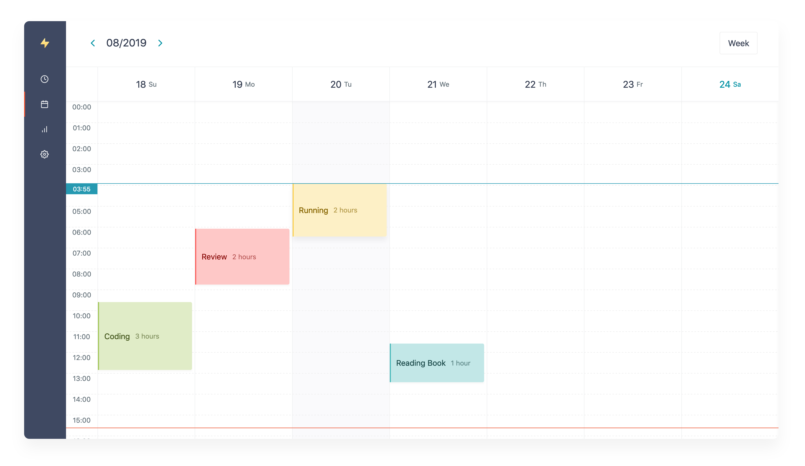
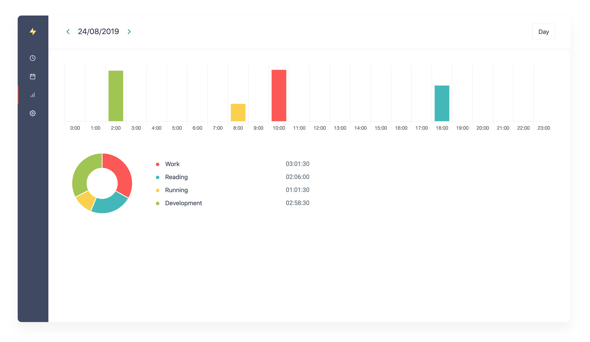

  

  
A simple time tracking application

## What's Hackaru?
Hackaru is the simple time tracking application.
> Hackaru (測る) means "Measure" in Japanese.

## Screens

## Features

- [PWA](https://developers.google.com/web/progressive-web-apps/) support. You can use on iOS and Android.
- OAuth 2.0 provider support.
- Open source. You can build on your server.

## Repos
- [hackaru-app/hackaru-web](https://github.com/hackaru-app/hackaru-web)
- [hackaru-app/hackaru-api](https://github.com/hackaru-app/hackaru-api)
- [hackaru-app/hackaru-desktop](https://github.com/hackaru-app/hackaru-desktop)
- [hackaru-app/hackaru-official](https://github.com/hackaru-app/hackaru-official)

## License
- [MIT](./LICENSE)

## Donation

