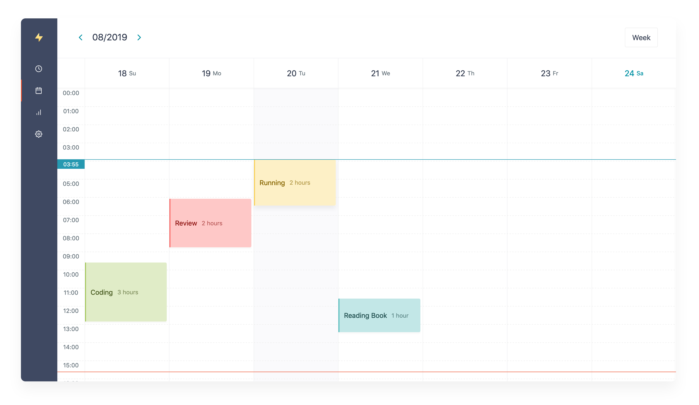
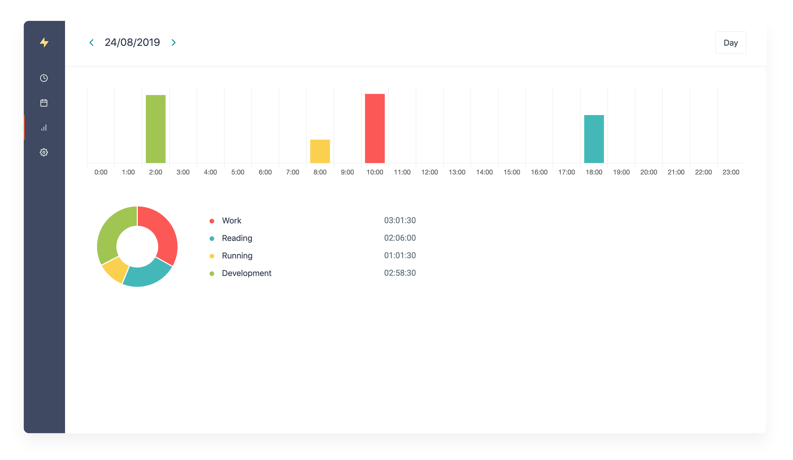

[](https://opensource.org/licenses/MIT)

<p align="center">
  <p align="center"></p>
  <p align="center" style="color: #666;">Manage your time.</p>
</p>

## What's Hackaru?
Hackaru is the simple time tracking application.
> Hackaru (測る) means "Measure" in Japanese.

## Screens




## Features

- [PWA](https://developers.google.com/web/progressive-web-apps/)  support. You can use on iOS and Android.
- OAuth 2.0 provider support.
- Webhook support.
- Open-source. You can build on your server.
- You can time automatically you are using favorite applications. See [Hackaru for Desktop](https://github.com/ktmouk/hackaru-desktop)

## How to use?
You can use Hackaru on the official website. It's free.
- https://www.hackaru.app

## Use Docker

Run this commands and access http://localhost:3333
```
git clone https://github.com/ktmouk/hackaru.git && \
cd ./hackaru && \
cp .env.api.sample .env.api && \
cp .env.web.sample .env.web && \
echo "SECRET_KEY_BASE=$(docker-compose run --rm api rails rake:secret)" >> .env.api && \
echo "JWT_SECRET=$(docker-compose run --rm api rails rake:secret)" >> .env.api && \
docker-compose run --rm api bin/setup && \
docker-compose up
```

## Repos
- [ktmouk/hackaru-web](https://github.com/ktmouk/hackaru-web)
- [ktmouk/hackaru-api](https://github.com/ktmouk/hackaru-api)
- [ktmouk/hackaru-desktop](https://github.com/ktmouk/hackaru-desktop)
- [ktmouk/hackaru-official](https://github.com/ktmouk/hackaru-official)

## License
- [MIT](./LICENSE)

## Donation
<a href="https://www.buymeacoffee.com/T4KDHBPV6"></a>  
